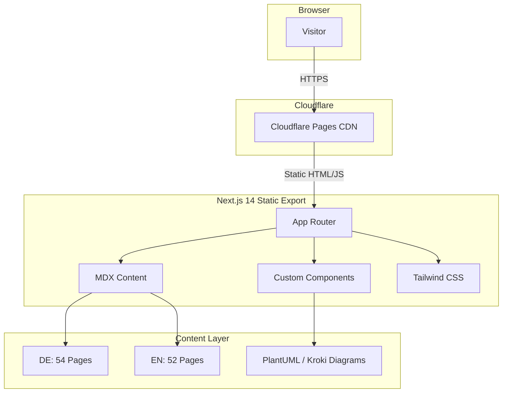
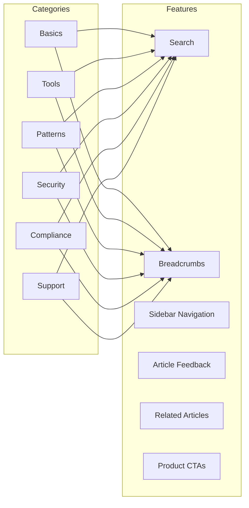

# >_< AI Engineering Wiki

The German-language knowledge base for Agent Orchestration, Multi-Agent Systems and GDPR-compliant AI stacks.

[](https://nextjs.org/)
[](https://tailwindcss.com/)
[](#content-overview)
[](#license)
[](./README.md)
[](./README-EN.md)

**Live:** [wiki.ai-engineering.at](https://wiki.ai-engineering.at)

---

## Table of Contents

- [Architecture](#architecture)
- [Content Overview](#content-overview)
- [Tech Stack](#tech-stack)
- [Components](#components)
- [Getting Started](#getting-started)
- [Deployment](#deployment)
- [Creating New Articles](#creating-new-articles)
- [Project Structure](#project-structure)
- [License](#license)

---

## Architecture





---

## Content Overview

| Category | DE | EN | Topics |
|----------|---:|---:|--------|
| **Basics** | 12 | 12 | Agent Orchestration, Multi-Agent Systems, Local vs Cloud, TCO |
| **Tools** | 12 | 12 | Docker, Ollama, RAG, n8n, Grafana, Proxmox, MCP Server |
| **Patterns** | 8 | 8 | Orchestration Patterns, Memory, Task Delegation, Safety Hooks |
| **Security** | 6 | 6 | API Keys, Firewall, Backup, Hardening |
| **Compliance** | 10 | 10 | GDPR, EU AI Act, Transparency Requirements, Data Protection |
| **Support** | 2 | 2 | Troubleshooting, FAQ |
| **Total** | **54** | **52** | **106 Pages** |

---

## Tech Stack

| Technology | Version | Purpose |
|------------|---------|---------|
| [Next.js](https://nextjs.org/) | 14.2 | App Router, Static Export |
| [React](https://react.dev/) | 18 | UI Components |
| [Tailwind CSS](https://tailwindcss.com/) | 3.4 | Styling (Blue/Slate Theme) |
| [MDX](https://mdxjs.com/) | 3.0 | Markdown + JSX Content |
| [TypeScript](https://typescriptlang.org/) | 5 | Type Safety |
| [PlantUML / Kroki](https://kroki.io/) | — | Technical Diagrams |
| [Cloudflare Pages](https://pages.cloudflare.com/) | — | Hosting & CDN |

---

## Components

18 custom components in `components/`:

| Component | Description |
|-----------|-------------|
| `SearchBar` | Full-text search across all articles |
| `Sidebar` | Category navigation with active state |
| `Breadcrumbs` | Hierarchical path navigation |
| `Callout` | Info/Warning/Danger notice boxes |
| `KeyTakeaway` | Highlighted key takeaways |
| `ComparisonTable` | Comparison tables (e.g., Local vs Cloud) |
| `PlantUMLDiagram` | Static PlantUML diagrams via Kroki |
| `PlantUMLDynamic` | Client-side PlantUML diagrams |
| `MermaidDiagram` | Static Mermaid diagrams |
| `MermaidDynamic` | Client-side Mermaid diagrams |
| `CaseStudyBox` | Real-world examples and case studies |
| `RelatedArticles` | Related articles at page bottom |
| `ArticleFeedback` | Reader feedback per article |
| `GlobalCta` | Product call-to-action banners |
| `EditOnGithub` | Link to edit on GitHub |
| `SiteHeader` | Navigation with DE/EN language switch |
| `SiteFooter` | Footer with links and copyright |
| `ClientLayout` | Client-side layout wrapper |

---

## Getting Started

```bash
# Clone repository
git clone https://github.com/AI-Engineering-AT/wiki.git
cd wiki

# Install dependencies
npm install

# Start development server
npm run dev
# -> http://localhost:3000
```

### Build

```bash
npm run build
# Static export to out/
```

### Lint

```bash
npm run lint
```

---

## Deployment

The wiki is deployed as a static export on **Cloudflare Pages**.

### Prerequisites

- Node.js 18+
- Cloudflare account with Pages access

### Deploy Process

```bash
# 1. Create build
npm run build

# 2. Deploy to Cloudflare Pages
npx wrangler pages deploy out/
```

### Cloudflare Pages Configuration

| Setting | Value |
|---------|-------|
| Build command | `npm run build` |
| Build output | `out/` |
| Node.js version | `18` |
| Custom Domain | `wiki.ai-engineering.at` |

---

## Creating New Articles

### 1. Create Page

Create a new `page.tsx` in the appropriate category:

```
app/grundlagen/my-new-article/page.tsx    # German
app/en/grundlagen/my-new-article/page.tsx  # English
```

### 2. Set Metadata

```tsx
export const metadata = {
  title: 'My Article | AI Engineering Wiki',
  description: 'Short description for SEO...',
}
```

### 3. Use Components

```tsx
import { Callout } from '@/components/Callout'
import { KeyTakeaway } from '@/components/KeyTakeaway'
import { ComparisonTable } from '@/components/ComparisonTable'
```

### 4. Test Build

```bash
npm run build
```

### 5. Languages

Create every article in **both DE and EN**. The URL structure is identical; EN articles live under `/en/`.

---

## Project Structure

```
wiki/
├── app/
│   ├── globals.css              # Design Tokens (Blue/Slate Theme)
│   ├── layout.tsx               # Root Layout + DE Navigation
│   ├── page.tsx                 # German Homepage
│   ├── grundlagen/              # 12 Articles
│   ├── tools/                   # 12 Articles
│   ├── patterns/                # 8 Articles
│   ├── security/                # 6 Articles
│   ├── compliance/              # 10 Articles
│   ├── support/                 # 2 Articles
│   └── en/                      # English Versions
│       ├── layout.tsx
│       ├── page.tsx
│       ├── grundlagen/          # 12 Articles
│       ├── tools/               # 12 Articles
│       ├── patterns/            # 8 Articles
│       ├── security/            # 6 Articles
│       ├── compliance/          # 10 Articles
│       └── support/             # 2 Articles
├── components/                  # 18 Custom Components
├── content/                     # MDX Content Files
├── lib/                         # Utility Functions
├── public/                      # Static Assets
├── tailwind.config.ts           # Tailwind Configuration
├── next.config.mjs              # Next.js Configuration
└── package.json
```

---

## License

(c) 2026 AI Engineering — All rights reserved.

---

## Contact

- **Website:** [ai-engineering.at](https://www.ai-engineering.at)
- **Wiki:** [wiki.ai-engineering.at](https://wiki.ai-engineering.at)
- **Email:** kontakt@ai-engineering.at
