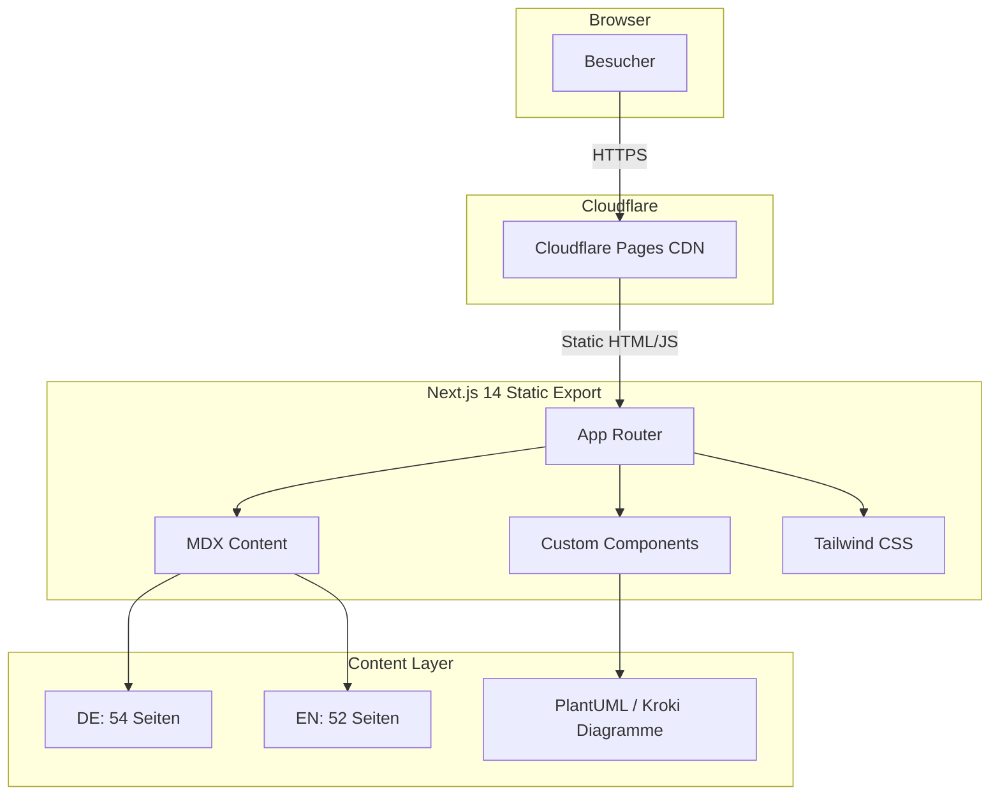
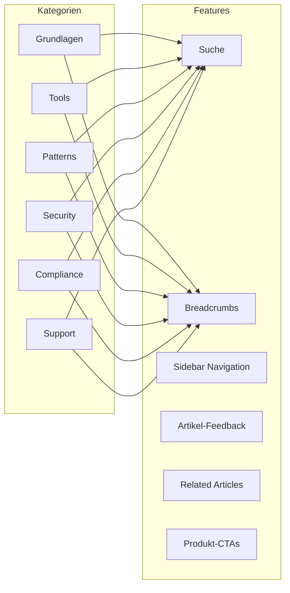

<div align="center">
  
</div>

# >_< AI Engineering Wiki

Die deutschsprachige Wissensdatenbank zu Agent Orchestration, Multi-Agent Systemen und DSGVO-konformem AI-Stack.

[](https://nextjs.org/)
[](https://tailwindcss.com/)
[](#content-overview)
[](#lizenz)
[](./README.md)
[](./README-EN.md)

**Live:** [wiki.ai-engineering.at](https://wiki.ai-engineering.at)

---

## Inhaltsverzeichnis

- [Architektur](#architektur)
- [Content Overview](#content-overview)
- [Tech Stack](#tech-stack)
- [Components](#components)
- [Getting Started](#getting-started)
- [Deployment](#deployment)
- [Neuen Artikel erstellen](#neuen-artikel-erstellen)
- [Projektstruktur](#projektstruktur)
- [Lizenz](#lizenz)

---

## Architektur





---

## Content Overview

| Kategorie | DE | EN | Themen |
|-----------|---:|---:|--------|
| **Grundlagen** | 12 | 12 | Agent Orchestration, Multi-Agent Systeme, Lokal vs Cloud, TCO |
| **Tools** | 12 | 12 | Docker, Ollama, RAG, n8n, Grafana, Proxmox, MCP Server |
| **Patterns** | 8 | 8 | Orchestration Patterns, Memory, Task Delegation, Safety Hooks |
| **Security** | 6 | 6 | API Keys, Firewall, Backup, Hardening |
| **Compliance** | 10 | 10 | DSGVO, EU AI Act, Transparenzpflichten, Datenschutz |
| **Support** | 2 | 2 | Troubleshooting, FAQ |
| **Gesamt** | **54** | **52** | **106 Seiten** |

---

## Tech Stack

| Technologie | Version | Zweck |
|-------------|---------|-------|
| [Next.js](https://nextjs.org/) | 14.2 | App Router, Static Export |
| [React](https://react.dev/) | 18 | UI Components |
| [Tailwind CSS](https://tailwindcss.com/) | 3.4 | Styling (Blue/Slate Theme) |
| [MDX](https://mdxjs.com/) | 3.0 | Markdown + JSX Content |
| [TypeScript](https://typescriptlang.org/) | 5 | Type Safety |
| [PlantUML / Kroki](https://kroki.io/) | — | Technische Diagramme* |
| [Cloudflare Pages](https://pages.cloudflare.com/) | — | Hosting & CDN |

> *PlantUML-Diagramme werden client-seitig über kroki.io gerendert. Dabei wird die IP-Adresse des Nutzers an den Kroki-Server übermittelt.

---

## Components

18 Custom Components in `components/`:

| Component | Beschreibung |
|-----------|-------------|
| `SearchBar` | Volltextsuche ueber alle Artikel |
| `Sidebar` | Kategorie-Navigation mit aktiver Markierung |
| `Breadcrumbs` | Hierarchische Pfad-Navigation |
| `Callout` | Info/Warning/Danger Hinweis-Boxen |
| `KeyTakeaway` | Hervorgehobene Kern-Aussagen |
| `ComparisonTable` | Vergleichstabellen (z.B. Lokal vs Cloud) |
| `PlantUMLDiagram` | Statische PlantUML-Diagramme via Kroki |
| `PlantUMLDynamic` | Client-seitige PlantUML-Diagramme |
| `MermaidDiagram` | Statische Mermaid-Diagramme |
| `MermaidDynamic` | Client-seitige Mermaid-Diagramme |
| `CaseStudyBox` | Praxis-Beispiele und Case Studies |
| `RelatedArticles` | Verwandte Artikel am Seitenende |
| `ArticleFeedback` | Leser-Feedback pro Artikel |
| `GlobalCta` | Produkt-Call-to-Action Banners |
| `EditOnGithub` | Link zum Bearbeiten auf GitHub |
| `SiteHeader` | Navigation mit Sprachwechsel DE/EN |
| `SiteFooter` | Footer mit Links und Copyright |
| `ClientLayout` | Client-seitiges Layout-Wrapper |

---

## Getting Started

```bash
# Repository klonen
git clone https://github.com/AI-Engineering-AT/wiki.git
cd wiki

# Abhaengigkeiten installieren
npm install

# Entwicklungsserver starten
npm run dev
# -> http://localhost:3000
```

### Build

```bash
npm run build
# Static Export in out/
```

### Lint

```bash
npm run lint
```

---

## Deployment

Die Wiki wird als Static Export auf **Cloudflare Pages** deployt.

### Voraussetzungen

- Node.js 18+
- Cloudflare Account mit Pages-Zugriff

### Deploy-Ablauf

```bash
# 1. Build erstellen
npm run build

# 2. Deploy auf Cloudflare Pages
npx wrangler pages deploy out/
```

### Cloudflare Pages Konfiguration

| Setting | Wert |
|---------|------|
| Build command | `npm run build` |
| Build output | `out/` |
| Node.js version | `18` |
| Custom Domain | `wiki.ai-engineering.at` |

---

## Neuen Artikel erstellen

### 1. Seite anlegen

Neue `page.tsx` in der passenden Kategorie erstellen:

```
app/grundlagen/mein-neuer-artikel/page.tsx    # Deutsch
app/en/grundlagen/mein-neuer-artikel/page.tsx  # Englisch
```

### 2. Metadata setzen

```tsx
export const metadata = {
  title: 'Mein Artikel | AI Engineering Wiki',
  description: 'Kurze Beschreibung fuer SEO...',
}
```

### 3. Components nutzen

```tsx
import { Callout } from '@/components/Callout'
import { KeyTakeaway } from '@/components/KeyTakeaway'
import { ComparisonTable } from '@/components/ComparisonTable'
```

### 4. Build testen

```bash
npm run build
```

### 5. Sprachen

Jeden Artikel in **DE und EN** erstellen. Die URL-Struktur ist identisch, EN-Artikel liegen unter `/en/`.

---

## Projektstruktur

```
wiki/
├── app/
│   ├── globals.css              # Design Tokens (Blue/Slate Theme)
│   ├── layout.tsx               # Root Layout + DE Navigation
│   ├── page.tsx                 # Deutsche Startseite
│   ├── grundlagen/              # 12 Artikel
│   ├── tools/                   # 12 Artikel
│   ├── patterns/                # 8 Artikel
│   ├── security/                # 6 Artikel
│   ├── compliance/              # 10 Artikel
│   ├── support/                 # 2 Artikel
│   └── en/                      # Englische Versionen
│       ├── layout.tsx
│       ├── page.tsx
│       ├── grundlagen/          # 12 Articles
│       ├── tools/               # 12 Articles
│       ├── patterns/            # 8 Articles
│       ├── security/            # 6 Articles
│       ├── compliance/          # 10 Articles
│       └── support/             # 2 Articles
├── components/                  # 18 Custom Components
├── content/                     # MDX Content Files
├── lib/                         # Utility Functions
├── public/                      # Static Assets
├── tailwind.config.ts           # Tailwind Configuration
├── next.config.mjs              # Next.js Configuration
└── package.json
```

---

## Lizenz

(c) 2026 AI Engineering — Alle Rechte vorbehalten.

---

## Kontakt

- **Website:** [ai-engineering.at](https://www.ai-engineering.at)
- **Wiki:** [wiki.ai-engineering.at](https://wiki.ai-engineering.at)
- **E-Mail:** kontakt@ai-engineering.at
